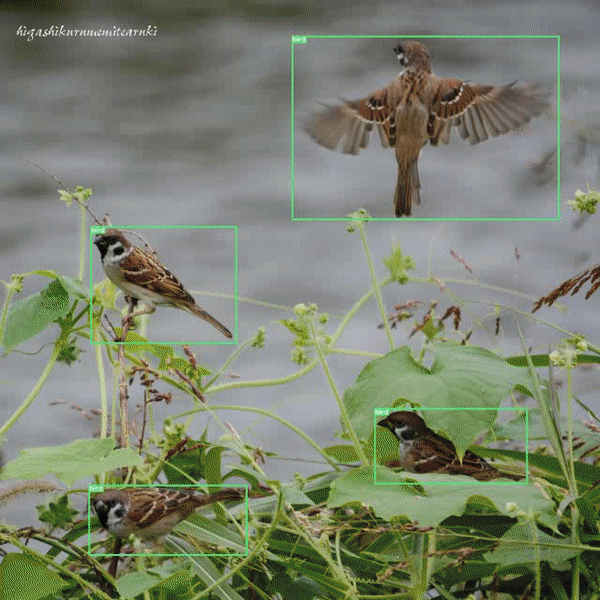
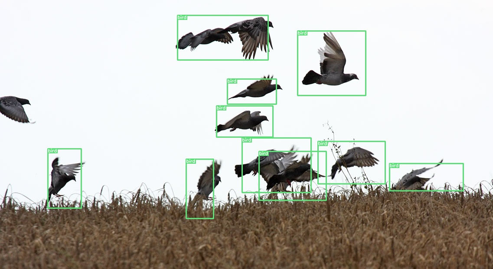

[](https://opensource.org/licenses/MIT)

# Pytorch Implementation of [Yolov3](https://pjreddie.com/media/files/papers/YOLOv3.pdf) For Bird Detection
***

This project provides a dataset for wild birds and yolov3 implementation in pytorch for training the dataset. This bird detection dataset is special in the sense that it also provides the dense labels of birds in flock.
The images of birds are collected from the internet, partly by crawling. Label samples can be seen as followings.

<table>
    <tr>
        <td>Label Samples</td>
    </tr>
    <tr>
        <td valign="top"></td>
    </tr>
</table>

## TODO ##
***

- [x] Train on Bird Dataset
- [x] Export onnx weight and test inferencing on onnx weight
- [x] Train on multiple scales
- [x] Mish activation
- [x] Onnx Model

## Preparation ##
***

```bash
python3 -m pip install -r requirements.txt
```

- Download darknet53 backbone trained on imagenet dataset
```bash
python3 scripts/download_darknet_weight.py
```

After running this script, darknet53.conv.74 weights will be saved inside save_models directory.

- Download bird dataset
```bash
python3 scripts/download_bird_dataset.py
```

The bird dataset will be saved and extracted in data directory

## Scripts ##
***

- Training (details for parameters please see train.py script)
```bash
python3 train.py --dataset bird_dataset --backbone_weight_path ./saved_models/darknet53.conv.74
```

Weights will be saved inside save_models directory.

- Testing
```bash
python3 test.py --dataset bird_dataset --snapshot [path/to/snapshot] --image_path [path/to/image] --conf_thresh [confidence/thresh] --nms_thresh [nms/thresh]
```

A sample trained weight can be download from [HERE](https://drive.google.com/file/d/1DkxLsReA-vEjjWG5jTtzL2gb_kQEZe6b/view?usp=sharing)

<table>
    <tr>
        <td>Test Result</td>
    </tr>
    <tr>
        <td valign="top"></td>
    </tr>
</table>

- Export to onnx model
```bash
python3 export_onnx.py --dataset bird_dataset --snapshot [path/to/weight/snapshot] --batch_size [batch/size] --onnx_weight_file [output/onnx/file]
```

- Inferece with onnx
```bash
python3 inference_onnx.py --dataset bird_dataset --img_h [img/input/height] --img_w [img/input/width] --image_path [image/path] --onnx_weight_file [onnx/weight] --conf_thresh [confidence/threshold] --nms_thresh [nms_threshold]
```

## References ##
***

- [Yolov3](https://pjreddie.com/media/files/papers/YOLOv3.pdf)
